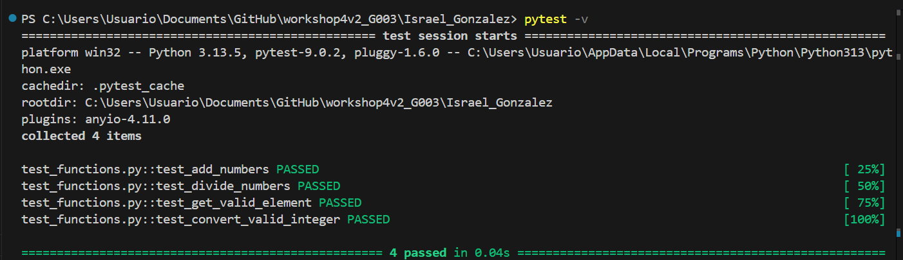
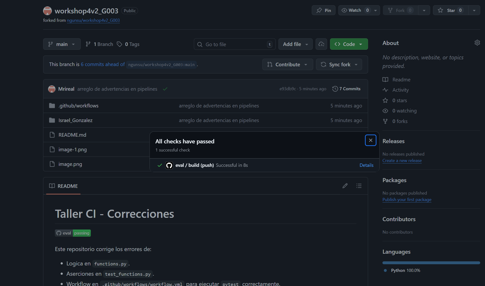

# Taller CI - Correcciones

Este repositorio corrige los errores de:

- Logica en `functions.py`.
- Aserciones en `test_functions.py`.
- Workflow en `.github/workflows/workflow.yml` para ejecutar `pytest` correctamente.

## Ejecucion local

```bash
pytest -v
```

## Evidencia de GitHub Actions

- Estado esperado: workflow en verde.
- Enlace a ejecuciones del workflow: https://github.com/Mrireal/workshop4v2_G003/actions
- Captura del Action en verde:


